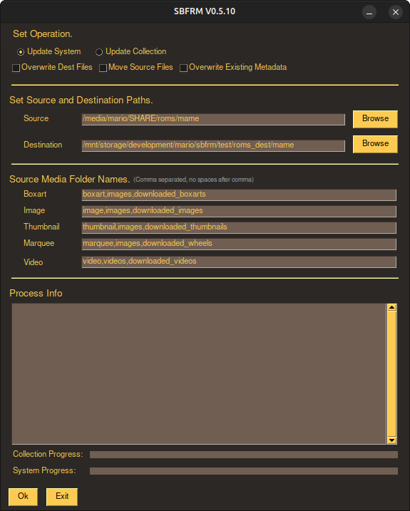

# **SBFRM**

[Versão em Português](README_Pt-Br.md) |
[Changelog](CHANGELOG.md) |
[Use Examples](examples/)

## A Manager for Retrogames Collections.

This manager is applied to collections in EmulationStation format (those with a gamelist.xml file inside). It is quite simple but at the same time very powerful. Initially it was just a script to do very simple things to manage my game collections (I am a game accumulator guy :). Over time I kept adding more features until I realized it was quite robust and could be useful for the community.

### The main features are:
- Merge collections;
- Avoid duplicate games;
- Avoid orphaned image and video files;
- Avoid wasting disk space;
- And, most importantly, generate the gamelist.xml file automatically.

## Graphical interface:

To use, simply download the binary for your O.S. in the [releases](releases/) folder and run. The binary was compiled from python code and does not need any requirements.

## Command line:

To use, you must have Python3 or higher installed. Run the script [sbfrm.py](sbfrm.py), passing the arguments as explained below, or open the gui [sbfrm_gui.py](sbfrm_gui.py).

### Requirements:
- Python3;
- Works on Linux and Windows.

See [examples](examples) in Windows [.bat](examples/windows/CobaltoV4_Pi3_16GB.bat) format and Linux [.sh](examples/linux/CobaltoV4_Pi3_16GB.sh) format.

The **SBFRM** is a python script, where you must enter several parameters in the input to perform the tasks you want.

####  The simplest way to run:

`python3 sbfrm.py update_collection src-collection/ dest-collection/`

####  Where:
- **update_collection** is the task you want to perform. In this case it is to add new roms to your collection;
- **src-collection/** is the path of the collection you want to add;
- **dest-collection/** is the path to your collection where the files will be added and the gamelist.xml generated or updated;

Run the command above and watch the magic happen. The run will automatically add new roms to your collection (without any image or video media in this case). It will also update the existing gamelist.xml file, or create a new one if it doesn't exist. The idea is, as far as possible, to avoid duplicate games, both in the files and in gamelist.xml

####  The folder structure in the example above should look similar to this.

- src-collection/
    - snes/
        - Name1 (USA,Japan).zip
        - Name2 (USA,Europe) (En,Fr,De).zip
        - Name3 (USA,Europe,Japan).zip
        - gamelist.xml
    - mastersystem/
        - Name4 (USA,Japan).zip
        - Name5 (USA) (En,Fr,De).zip
        - Name6 (USA,Europe,Japan).zip
        - gamelist.xml
    - megadrive/
        - Name7 (USA,Japan).zip
        - Name8 (USA) (En,Fr,De).zip
        - Name9 (USA,Europe,Japan).zip
        - gamelist.xml

- dest-collection/
    - snes/
        - Name2 (USA).zip
        - gamelist.xml
    - megadrive/
        - Name7 (Japan).zip
        - Name8 (En).zip
        - Name9.zip
        - gamelist.xml

#### The script will perform the following work:

- In the **snes/** folder only **Name1** and **Name3** will be added. The rom **Name2** will not be added because the version **Name2 (USA)** already exists at the destination;
- In the **mastersystem** folder all three roms will be added;
- In the **megadrive** folder no rom will be added, because all of them already have a version at the destination;

#### The final result of your collection will be as shown below:

- dest-collection/
    - snes/
        - Name1 (USA,Japan).zip
        - Name2 (USA).zip
        - Name3 (USA,Europe,Japan).zip
        - gamelist.xml
    - mastersystem/
        - Name4 (USA,Japan).zip
        - Name5 (USA) (En,Fr,De).zip
        - Name6 (USA,Europe,Japan).zip
        - gamelist.xml
    - megadrive/
        - Name7 (Japan).zip
        - Name8 (En).zip
        - Name9.zip
        - gamelist.xml

The example above is the simplest thing that sbfrm can do. In fact, it is capable of more complex things, like managing sub-collections (snes/## HACKS ##/) for example. The complete list of parameters is shown below:

#### Mandatory Parameters:
- **op**: Operation to be performed.
    - **update_collection**: Updates, in **dest/**, all roms, images and video files for each collection (game system) present in **src/**. Updates the **gamelist.xml** of each collection, or creates a new one if it doesn't exist;
    - **update_system**: Updates the respective system, or creates a new one if it does not exist, and its subsystems. Subsystems are understood as folders with roms inside a system (e.g. ## HACKS ##). This operation works together with the optional parameter **-subsyslist**. If the optional parameter is not passed, no subsystems will be updated or added;
- **src/**: Path to the directory where the collection to be added is located.
    - Ex: /media/user/SHARE1/roms
- dest/**: Path of the directory where the files are to be added.
    - Ex: /media/user/SHARE/roms

#### Optional Parameters:
- **-box_src**: Name of the directory where the game box image files that are to be added to your collection are located (e.g. -box_src Named_Boxarts or box_src downloaded_images). If this parameter is not declared, these media files will not be updated in the target collection.
- **-img_src**: Name of the directory where the gameplay image files to be added to your collection are located (e.g. -img_src Named_Snaps or -img_src downloaded_images). If this parameter is not declared, these media files will not be updated in the target collection.
- **-marq_src**: Name of the directory where the game lettering image files to be added to your collection are located (e.g. -marq_src Named_Marks or -marq_src downloaded_wheels). If this parameter is not declared, these media files will not be updated in the target collection.
- **-thumb_src**: Name of the directory containing the small game title image files to be added to your collection (e.g. -thumb_src Named_Titles or -thumb_src downloaded_images). If this parameter is not declared, these media files will not be updated in the target collection.
- **-vid_src**: Name of the directory containing the games' video files to be added to your collection (e.g. -vid_src videos or -vid_src downloaded_videos). If this parameter is not declared, these media files will not be updated in the target collection.
- **-subsyslist**: List of sub-collections to be considered during script processing (ex: -subsys_list "## HACKS ##, # PT-BR #, # TECTOY #"). The list must be separated by commas, with no spaces between items, and enclosed in double quotes. For each collection present in **src**, the entire list will be evaluated, and, if any subdirectory exists with the same name as the item, the script will update or raise the subsystem.
- **-filemode**: Defines whether files will be copied or moved to the destination (e.g. -filemode cp or -filemode mv). This option is very useful if you have limited disk space or want the processing to be faster (files are moved almost instantly if they are within the same partition :p).

#### Reports on Collection Composition and Media File Organization

After the script is processed, a set of text files with totals of missing files and media information will be created for each of the collections present in **dest/**. These files are very useful for identifying and adding what is missing in the collection. For example, through them you can create a task force to complete all the information in a collection.

The previous **gamelist.xml** will also be backup to avoid as much as possible the loss of information in case a problem occurs.

Also, each game media type will be placed in its own directory. The following will detail the composition of the report files and the folder structure of each collection:

- **dest-collection/**
    - **system/**
        - **boxarts/**: Folder where the image files of the collection's game boxes are stored.
        - **images/**: Folder where the gameplay image files of collection's games are stored.
        - **markers/**: The folder where the signage images files of collection's games are stored.
        - **thumbnails/**: Folder where the title screen image files of collection's games are stored.
        - **videos/**: Folder where the gameplay video files of collection's games are stored.
        - **gamelist_yyyymmdd-hhmmss.txt/**: Backup of the previous gamelist.xml, with the date and time of the backup.
        - **gamelist_results.txt/**: Text file with the game totals, media, and descriptions, both in the files and in **gamelist.xml**.
        - **game_wihout_box.txt/**: Text file listing the images of the collection's missing boxes.
        - **game_wihout_image..txt/**: Text file with the list of the collection's missing gameplay images.
        - **game_wihout_marquee.txt/**: Text file with the list of the lettering's images missing from the collection.
        - **game_wihout_thumbnails.txt/**: Text file with the list of the gameplay images missing from the collection.
        - **game_wihout_video.txt/**: Text file with the list of gameplay videos missing from the collection.

It is not my intention to think that this is a spectacular project and that there is no other equal or better one. There is a lot that can be improved, certainly there are bugs that I didn't notice, a lot of code refactoring to be done, lack of test implementation, etc, etc. But I hope it will be useful to you and help you save a lot of disk space and time organizing your roms. Time that should be used for playing and having fun. If you got this far, it is because you are really interested in my work and probably are, or will at some point, wonder what the hell sbfrm means, which is the acronym for Small Big Fucking Retro Gamelist Manager :)

Otherwise, here are my ideas for future work to be implemented (when I have some time to spare):
- Graphical Interface (to make it easier to use for those who are not used to using command line);
- Implement a new method to compare two directories and remove duplicate files from one of them (ex: remove the translated roms from the directory **nes/** and that are already present in the directory **nes/# PT-BR #/**);
- Improve the comparison of duplicate files. The current comparison has good results but it is quite simple. Using regex it may be possible to do more complex things like select files from a certain region, language, revision, etc.
- Write a document with examples and tricks of the cool things that I' ve been able to do with sbfrm
- Improve my english :p

Donation:

    "I have no special talent. I am only passionately curious."
    -Albert Einstein

Would you like to see this project continue to progress? Your help will be very welcome!

https://www.paypal.com/donate?hosted_button_id=G7KRYRNQ247AG

