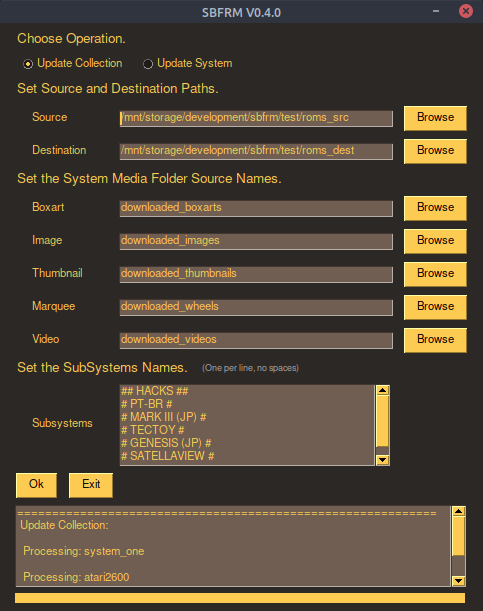

# **SBFRM**

[English Version](https://github.com/marioacjr/sbfrm) |
[Changelog](CHANGELOG.md) |
[Examplos de Uso](examples/)

# Um Gerenciador para Coleções de Jogos Retrô.

Este gerenciador é utilizado em coleções no formato do EmulationStation (aquelas com um arquivo gamelist.xml dentro). É bastante simples mas, ao mesmo tempo, muito poderoso. Inicialmente era apenas um script para fazer coisas muito simples para me ajudar a organizar minhas coleções de jogos (eu sou aquele tipo acumulador de jogos :). Com o tempo continuei a acrescentar mais funcionalidades até perceber que já estava bastante robusto e que podia ser útil para a comunidade.

## As principais características são:
- Mesclar uma coleção Fonte em uma coleção Destino;
- Evitar a duplicação de roms e suas mídias associadas;
- Evitar arquivos de imagem e vídeo órfãos (sem um game relativo);
- Evitar desperdício de espaço em disco;
- Localizar os arquivos de mídia de um game e incluí-los automaticamente na gamelist.xml.
- Gerar o arquivo gamelist.xml pequeno, porém completo.
- Reduzir o tempo necessário para fazero o scrapper nas coleções através do reaproveitamento das informações já existentes.

# Releases:

## Executável:

Para utilizar, bastar baixar o binário para seu S.O. na pasta [releases](releases/) e executar. O binário foi compilado a partir deste código python e não necessita de nenhum requerimento para funcionar.

### Requerimentos:
- Linux ou Windows.

## Linha de comando:

Para utilizar, é necessário ter instalado o Python3 ou superior. Execute o script [sbfrm.py](sbfrm.py), passando os argumntos conforme mostrado a seguir abaixo. As dependências necessárias estão listadas no arquivo requirements.txt. É aconselhável criar um ambiente virtual para a instalação das dependências (isto evita que os pacotes das dependências sejam instalados diretamente na instalação do python do seu S.O.).

### CLI:
    `python3 sbfrm.py update_collection src-collection-path/ dest-collection-path/`

### GUI:
    `python3 sbfrm_gui.py` 

### Requerimentos:
- Python3;
- Linux ou Windows.
- Pacotes:
    - PySimpleGUI (apenas para sbfrm_gui.py)

Veja [exemplos](examples).

## Sobre este Projeto
O **SBFRM**, é um script python, onde se deve passar alguns parâmetros na linha de comando para realizar as tarefas que se deseja.

####  A forma mais simples de executar é:

    `python3 sbfrm.py update_collection src-collection-path/ dest-collection-path/`

####  Onde:
- **update_collection*** é a tarefa que deseja realizar. Neste caso, é adicionar novas roms à sua coleção;
- **src-collection-path**: é o caminho da coleção fonte que deseja adicionar;
- **dest-collection-path**: é o caminho da sua coleção onde os arquivos serão adicionados e a gamelist.xml gerada ou atualizada;

Rode o comando acima e veja a magia acontecer. A execução irá acrescentar novas roms à sua coleção de forma automática. Também irá atualizar o arquivo gamelist.xml existente, ou criar um novo caso não exista. O objetivo do processo é evitar jogos duplicados e mídias órfãs.

#### A estrutura de pastas do exemplo acima deve ser semelhante a estas abaixo.

- src-collection-path
    - system_one/
        - Game AA (Europe, Japan).zip
        - Game AA (Europe, Japan) (Demo).zip
        - Game AA (Japan).zip
        - Game AA (USA).zip
        - Game AA (USA, Europe, Japan).zip
        - GAMEBB.zip
        - GAMEBBBB.zip
        - gamelist.xml
    - system_two/
        - Game CC (Europe, Japan).zip
        - Game CC (Europe, Japan) (Demo).zip
        - Game CC (USA).zip
        - GAMEDD.zip
        - GAMEDDDD.zip
        - gamelist.xml

- dest-collection-path/
    - system_one/
        - Game AA (Japan).zip
        - gamelist.xml
    - system_three/
        - Game EE (Europe, Japan).zip
        - Game EE (USA).zip
        - gamelist.xml

    

#### A execução do script realizará o seguinte trabalho:

- Na pasta **system_one/** da coleção destino, será adicionado a rom **Game AA (USA).zip** e **GAMEBB.zip**. Será removida a rom **Game AA (Japan).zip**, pois a sua versão (USA) foi encontrada na coleção de origem. Todas as mídias de imagem e vídeos e metadados relativos às duas roms serão copiados para a coleção destino. Da mesma forma, todas as mídias e metadados associados à rom **Game AA (Japan).zip** serão movidos para a pasta de backup **system_one_removed/**;
- Será criada uma pasta para o systema **system_two/**. Será copiada as roms **Game CC (USA).zip** e **GAMEDD.zip**. Todos os arquivos de mídia e metadados associados a essas duas roms serão copiados.
- A pasta **system_three/** da coleção destino não sofrerá nenhuma modificação.

#### O resultado final da sua coleção será como mostrado abaixo:

- dest-collection-path/
    - system_one/
        - Game AA (USA).zip
        - GAMEBB.zip
        - gamelist.xml
    - system_three/
        - Game CC (USA).zip
        - GAMEDD.zip
        - gamelist.xml
    - system_three/
        - Game EE (Europe, Japan).zip
        - Game EE (USA).zip
        - gamelist.xml

#### Parâmetros Obrigatórios:
- **op**: Operação a ser efetuada.
    - **update_collection**: Atualiza, em **dest-collection-path/**, todos os arquivos de roms, imagens e vídeos para cada sistema da coleção presentes em **src-collection-path/**. Atualiza o **gamelist.xml** de cada sistema, ou cria um novo caso não exista;
    - **update_system**: Atualiza o respectivo sistema ou cria um novo, caso não exista. ;
- **src-collection-path/**: Caminho do diretório onde está a coleção a ser adicionada.
    - Ex: /media/user/SHARE1/roms
- **dest-collection-path/**: Caminho do diretório onde os arquivos devem ser adicionados.
    - Ex: /media/user/SHARE/roms

#### Configurações Opcionais:
É possível personalizar algumas operações antes da execução, como prioridade de região das roms e nome das pastas de mídia das coleções. Estas personalizações devem ser realizadas através da alteraçãos dos seus parâmetros no arquivo **configs.json**. Este arquivo deve seguir a estrutura pré-estabelecida existente no formato JSON. A seguir será descrito o comportamento de cada um desses parâmetros.

- **-src_media_dirs_list**: Contém a lista de pastas onde o script deve procurar pelas mídas associadas às roms na coleção de origem. Dentro de cada lista dos seus sub itens, deve ser inserido o nome da pasta onde estão localizados as mídias daquele tipo.

- **-dest_media_dirs_names**: Contém o nome das pastas das mídias da coleção destino. Cada tipo de mídia deve conter um, e apenas um, nomepara a mídia do respectivo tipo.

- **-filemode**: Define o tipo de operação realizada da coleção de origem para a coleção destino. Em **options** estão as opções de operação disponíveis (**este parâmetro não deve ser alterado**). Em **mode** deve ser informado o tipo desejado. O tipo **cp** copia os arquivos da origem para o destino. Este tipo de operação é mais seguro, porém mais lento. O tipo **mv** move os arquivos da origem para o destino. Este modo é mais rápido quando a origem e destino estão localizados na mesma partição.

- **-overwrite_file**: Define de o arquivo de destino deve ser sobrescrito, caso exista. Altere este parâmetro para 0 (zero) caso não queira sobrescrever e para 1 (hum) caso contrário.

- **-overwrite_gamelist_info**: Define se os metadados do arquivos **gamelist.xml** do destino devem ser sobrescritos pelos novos dados localizados na origem.

- **-verbose**: Define se deve ser gerado uma saída textual no teminal de execução ou gui do usuário.

- **region_order**: Define a lista de prioridades das regiões das roms a serem mantidas na coleção destino. O primeiro ítem desta lista tem maior prioridade sobro segundo,e assim sucessivamente. Cada ítem desta lista deve aparecer entre parêntesis no nome das roms.

- **removed_devcomm_status**: Contém a lista dos status de desenvolvimento e comercial das roms que devem ser removidas da coleção destino. Cada ítem desta lista deve aparecer entre parêntesis no nome das roms.

## Relatórios das coleções e Organização dos Arquivos de Mídia

Após o processamento do script, um conjunto de arquivos de texto, com informações dos totais de arquivos de mídias ausentes, será criado para cada uma das coleções presentes em **dest/**. Estes arquivos são bastantes úteis para identificar e adicionar o que está faltando na coleção. Por exemplo, por meio deles, pode-se criar uma força-tarefa para completar todas as informações ausentes de uma coleção.

Também será realizado um backup da **gamelist.xml** anterior para evitar ao máximo a perda de informação caso algum problema ocorra.

## Considerações Finais

Longe de mim achar que esse é um projeto espetacular e que não haja outro igual ou melhor. Tem muita coisa que pode ser melhorada, certamente tem bugs que eu não percebi, muita refatoração de código para ser feita, falta implementar mais testes e etc, etc. De qualquer modo, espero que ele lhe seja útil e ajude a ganhar espaço em disco e poupar muito tempo organizando suas roms. Tempo esse que dever ser usado para jogar e se divertir.

Se você chegou até aqui, é porque realmente se interessou pelo meu trabalho e provavelmente está, ou vai em algum momento, se perguntar que diabos significa **sbfrm**, que é o acrônimo para Small Big Fucking Retro Gamelist Manager. Sim, eu estava muito inspirado quando buscava um nome para este projeto :p

De resto, fica minhas ideias de trabalhos futuros a ser implementado (quando eu tiver algum tempo sobrando):
- Melhorar a comparação de arquivos duplicados. A comparação atual, apesar de simples, tem bons resultados mas certamente tem muito a melhorar.
- Implementar um sistema de prioridades de língua das roms.
- Escrever um documento melhor com exemplos e truques de coisas legais que é pssível fazer com o **sbfrm**.
- Melhorar meu Inglês :p

Doações:

    "Não tenho nenhum talento especial. Estou apenas apaixonadamente curioso."
    -Albert Einstein

Gostaria de ver este projeto evoluir? Sua ajuda será muito bem vinda!

https://www.paypal.com/donate?hosted_button_id=G7KRYRNQ247AG

