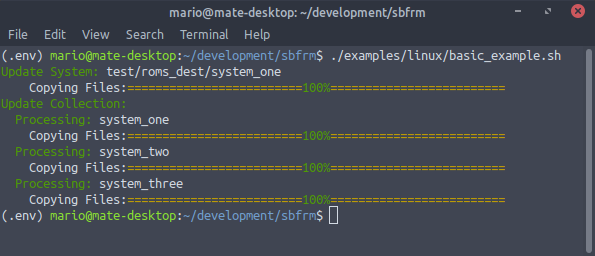

# **SBFRM**

[English Version](https://github.com/marioacjr/sbfrm) |
[Changelog](CHANGELOG.md) |
[Examplos de Uso](examples/)

## Um Gerenciador para Coleções de Jogos Retrô.

Este gerenciador é utilizado em coleções no formato do EmulationStation (aquelas com um arquivo gamelist.xml dentro). É bastante simples mas, ao mesmo tempo, muito poderoso. Inicialmente era apenas um script para fazer coisas muito simples para me ajudar a organizar minhas coleções de jogos (eu sou aquele tipo acumulador de jogos :). Com o tempo continuei a acrescentar mais funcionalidades até perceber que já estava bastante robusto e que podia ser útil para a comunidade.

### As principais características são:
- Mesclar coleções;
- Evitar a duplicação de jogos;
- Evitar arquivos de imagem e vídeo órfãos;
- Evitar desperdício de espaço em disco;
- E, mais importante, gerar o arquivo gamelist.xml automaticamente.

## Releases Executáveis:

Para utilizar, bastar baixar o binário para seu S.O. na pasta [releases](releases/) e executar. O binário foi compilado a partir deste código python e não necessita de nenhum requerimento para funcionar.

## Linha de comando:

Para utilizar, é necessário ter instalado o Python3 ou superior. Execute o script [sbfrm.py](sbfrm.py), passando os argumntos conforme explicado a seguir, ou abra a gui [sbfrm_gui.py](sbfrm_gui.py).

### Requerimentos:
- Python3;
- Funciona em Linux e Windows.

Veja [exemplos](examples) em formato Windows [.bat](examples/windows/CobaltoV4_Pi3_16GB.bat) e Linux [.sh](examples/linux/CobaltoV4_Pi3_16GB.sh).

O **SBFRM**, é um script python, onde se deve passar vários parâmetros na linha de comando para realizar as tarefas que se deseja.

####  A forma mais simples de executar é:

`python3 sbfrm.py update_collection src-collection/ dest-collection/`

####  Onde:
- **update_collection*** é a tarefa que deseja realizar. Neste caso, é adicionar novas roms à sua coleção;
- **src-collection/***é o caminho da coleção que deseja adicionar;
- **dest-collection/** é o caminho da sua coleção onde os arquivos serão adicionados e a gamelist.xml gerada ou atualizada;

Rode o comando acima e veja a magia acontecer. A execução irá acrescentar novas roms à sua coleção de forma automática (sem qualquer mídia de imagem ou vídeo neste caso). Também irá atualizar o arquivo gamelist.xml existente, ou criar um novo caso não exista. A ideia é, na medida do possível, evitar jogos duplicados, tanto nos arquivos quanto no gamelist.xml

#### A estrutura de pastas do exemplo acima deve ser semelhante a estas abaixo.

- src-collection/
    - snes/
        - Name1 (USA,Japan).zip
        - Name2 (USA,Europe) (En,Fr,De).zip
        - Name3 (USA,Europe,Japan).zip
        - gamelist.xml
    - mastersystem/
        - Name4 (USA,Japan).zip
        - Name5 (USA) (En,Fr,De).zip
        - Name6 (USA,Europe,Japan).zip
        - gamelist.xml
    - megadrive/
        - Name7 (USA,Japan).zip
        - Name8 (USA) (En,Fr,De).zip
        - Name9 (USA,Europe,Japan).zip
        - gamelist.xml

- dest-collection/
    - snes/
        - Name2 (USA).zip
        - gamelist.xml
    - megadrive/
        - Name7 (Japan).zip
        - Name8 (En).zip
        - Name9.zip
        - gamelist.xml

#### A execução do script realizará o seguinte trabalho:

- Na pasta **snes/** serão adicionados apenas **Name1** e **Name3**. A rom **Name2** não será adicionada porque já existe a versão **Name2 (USA)** no destino;
- Na pasta **mastersystem** serão adicionadas todas as três roms;
- Na pasta **megadrive** não será adicionada nenhuma rom, pois todas já possuem uma versão no destino;

#### O resultado final da sua coleção será como mostrado abaixo:

- dest-collection/
    - snes/
        - Name1 (USA,Japan).zip
        - Name2 (USA).zip
        - Name3 (USA,Europe,Japan).zip
        - gamelist.xml
    - mastersystem/
        - Name4 (USA,Japan).zip
        - Name5 (USA) (En,Fr,De).zip
        - Name6 (USA,Europe,Japan).zip
        - gamelist.xml
    - megadrive/
        - Name7 (Japan).zip
        - Name8 (En).zip
        - Name9.zip
        - gamelist.xml

O exemplificado acima é o mais simples que o sbfrm pode fazer. De fato, ele é capaz coisas mais complexas, como gerenciar subsistemas (snes/## HACKS ##/) por exemplo. A lista completa de parâmetros é mostrada a seguir:

#### Parâmetros Obrigatórios:
- **op**: Operação a ser efetuada.
    - **update_collection**: Atualiza, em **dest/**, todos os arquivos de roms, imagens e vídeos para cada coleção (sistema de jogos) presentes em **src/**. Atualiza o **gamelist.xml** de cada coleção, ou cria um novo caso não exista;
    - **update_system**: Atualiza o respectivo sistema ou cria um novo, caso não exista, e seus subsistemas. Entende-se como subsistema as pastas com roms dentro de um sistema (ex: ## HACKS ##). Esta operação trabalha em conjunto com o parâmetro opcional **-subsyslist**. Caso o parâmetro opcional não seja passado, nenhuma subcoleção será atualizada ou adicionada;
- **src/**: Caminho do diretório onde está a coleção a ser adicionada.
    - Ex: /media/user/SHARE1/roms
- **dest/**: Caminho do diretório onde os arquivos devem ser adicionados.
    - Ex: /media/user/SHARE/roms

#### Parâmetros Opcionais:
- **-box_src**: Nome do diretório onde estão os arquivos de imagens das caixas dos jogos que deverão ser adicionadas à sua coleção (ex: -box_src Named_Boxarts ou box_src downloaded_images). Caso este parâmetro não seja declarado, estes arquivos de mídia não serão atualizados na coleção destino.
- **-img_src**: Nome do diretório onde estão os arquivos de imagens do gameplay dos jogos que deverão ser adicionadas à sua coleção (ex: -img_src Named_Snaps ou -img_src downloaded_images). Caso este parâmetro não seja declarado, estes arquivos de mídia não serão atualizados na coleção destino.
- **-marq_src**: Nome do diretório onde estão os arquivos de imagens do letreiro dos jogos que deverão ser adicionadas à sua coleção (ex: -marq_src Named_Marquees ou -marq_src downloaded_wheels). Caso este parâmetro não seja declarado, estes arquivos de mídia não serão atualizados na coleção destino.
- **-thumb_src**: Nome do diretório onde estão os arquivos de imagens da tela de título dos jogos que deverão ser adicionadas à sua coleção (ex: -thumb_src Named_Titles ou -thumb_src downloaded_images). Caso este parâmetro não seja declarado, estes arquivos de mídia não serão atualizados na coleção destino.
- **-vid_src**: Nome do diretório onde estão os arquivos de vídeo da gamepley dos jogos que deverão ser adicionadas à sua coleção (ex: -vid_src videos ou -vid_src downloaded_videos). Caso este parâmetro não seja declarado, estes arquivos de mídia não serão atualizados na coleção destino.
- **-subsyslist**: Lista de subsistemas a serem considerados durante o processamento do script (ex: -subsys_list "## HACKS ##, # PT-BR #, # TECTOY #"). A lista deve ser separada por vírgula, sem espaços entre os itens e estar dentro de aspas duplas. Para cada coleção presente em **src/**, a lista inteira será avaliada, e, caso algum subdiretório exista com o mesmo nome do item, o script irá atualizar ou elevar a subcoleção.
- **-filemode**: Define se os arquivos serão copiados ou movidos para o destino (ex: -filemode cp ou -filemode mv). Essa opção é muito útil caso você tenha limitação de espaço em disco ou deseja que o processamento seja realizado de forma mais rápida (arquivos são movidos quase instantaneamente se estiverem dentro da mesma partição :p).

## Relatórios das coleções e Organização dos Arquivos de Mídia

Após o processamento do script, um conjunto de arquivos de texto, com informações de totais de arquivos e mídias ausentes, será criado para cada uma das coleções presentes em **dest/**. Estes arquivos são bastantes úteis para identificar e adicionar o que está faltando na coleção. Por exemplo, por meio deles, pode-se criar uma força-tarefa para completar todas as informações de uma coleção.

Também será realizado um backup da **gamelist.xml** anterior para evitar ao máximo a perda de informação caso algum problema ocorra.

Além disso, cada tipo de mídia dos jogos será inserida em um diretório proprio para ela. A seguir será detalhado a composição dos arquivos de relatório e a estrutura de pastas de cada coloção:

- **dest-collection/**
    - **sistema/**
        - **boxart/**: Pasta onde estão adicionados os arquivos de imagens das caixas dos jogos da coleção.

        - **image/**: Pasta onde estão adicionados os arquivos de imagens do gameplay dos jogos da coleção.

        - **marquee/**: Pasta onde estão adicionados os arquivos de imagens do letreiro dos jogos da coleção.

        - **thumbnails/**: Pasta onde estão adicionados os arquivos de imagens da tela de titulo dos jogos da coleção.

        - **video/**: Pasta onde estão adicionados os arquivos de vídeo de demostração dos jogos da coleção.

        - **gamelist_yyyymmdd-hhmmss.txt/**: Backup do gamelist.xml anterior, com a data e hora do backup.
        - **sbfrm_reports/**
          - **game_wihout_box.txt/**: Arquivo de texto com a lista das imagens das boxarts ausentes da coleção.

          - **game_wihout_image.txt/**: Arquivo de texto com a lista das imagens de gameplay ausentes da coleção.

          - **game_wihout_marquee.txt/**: Arquivo de texto com a lista das imagens de letreiro ausentes da coleção.

          - **game_wihout_thumbnails.txt/**: Arquivo de texto com a lista das imagens do gameplay ausentes da coleção.

          - **game_wihout_video.txt/**: Arquivo de texto com a lista dos vídeos de gameplay ausentes da coleção.

          - **game_wihout_info_name.txt/**: Arquivo de texto com a lista dos jogos sem o nome no gamelist.txt.

          - **game_wihout_info_desc.txt/**: Arquivo de texto com a lista dos jogos sem a descrição no gamelist.txt.

          - **game_wihout_info_genre.txt/**: Arquivo de texto com a lista dos jogos sem o gênero do jogo no gamelist.txt.

          - **demais arquivos de relatório**

Longe de mim achar que esse é um projeto espetacular e que não haja outro igual ou melhor. Tem muita coisa que pode ser melhorada, certamente tem bugs que eu não percebi, muita refatoração de código para ser feita, falta implementar testes, etc, etc. Mas espero que ele lhe seja útil e ajude a ganhar espaço em disco e poupar muito tempo organizando suas roms. Tempo esse que dever ser usado para jogar e se divertir. Se você chegou até aqui, é porque realmente se interessou pelo meu trabalho e provavelmente está, ou vai em algum momento, se perguntar que diabos significa sbfrm, que é o acrônimo para Small Big Fucking Retro Gamelist Manager :)

De resto, fica minhas ideias de trabalhos futuros a ser implementado (quando eu tiver algum tempo sobrando):
- Interface Gráfica (para facilitar a utilização para quem não é acostumado a usar linha de comando);
- Implementar um novo método para comparar dois diretórios e remover arquivos duplicados de um deles (ex: remover as roms traduzidas do diretório **:nes/**: e que já estão presentes no diretório **:nes/# PT-BR #/**:);
- Melhorar a comparação de arquivos duplicados. A comparação atual tem bons resultados mas é bem simples. Usando regex poderá ser possível fazer coisas mais complexas como selecionar arquivos de determinada região, idioma, revisão, etc.
- Escrever um documento com exemplos e truques de coisas legais que eu já consegui fazer com o sbfrm
- Melhorar meu Português :p

Doações:

    "Não tenho nenhum talento especial. Estou apenas apaixonadamente curioso."
    -Albert Einstein

Gostaria de ver este projeto evoluir? Sua ajuda será muito bem vinda!

https://www.paypal.com/donate?hosted_button_id=G7KRYRNQ247AG

